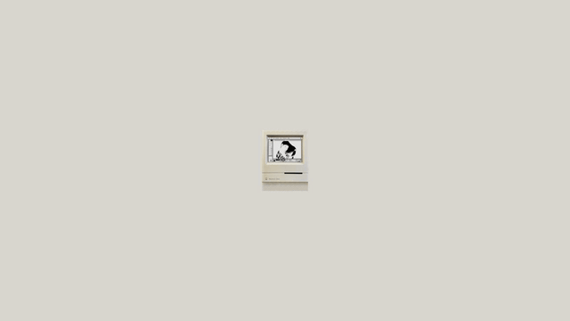
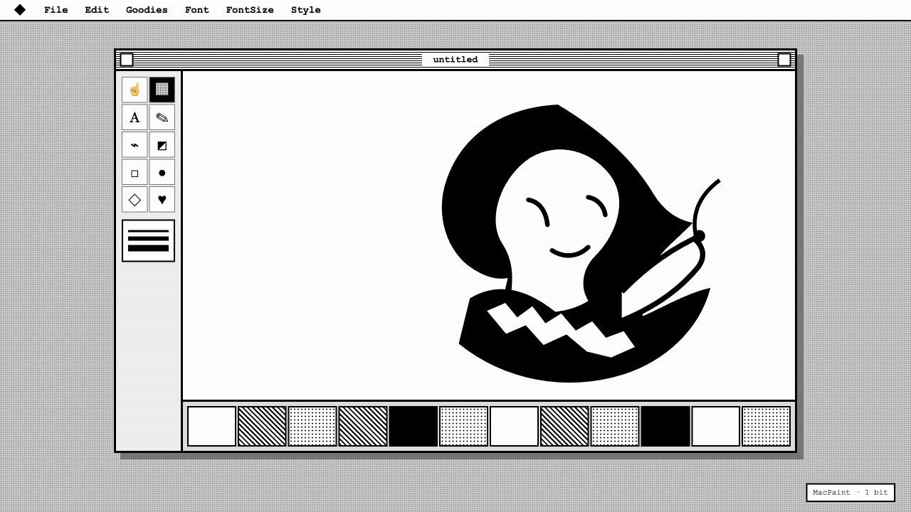
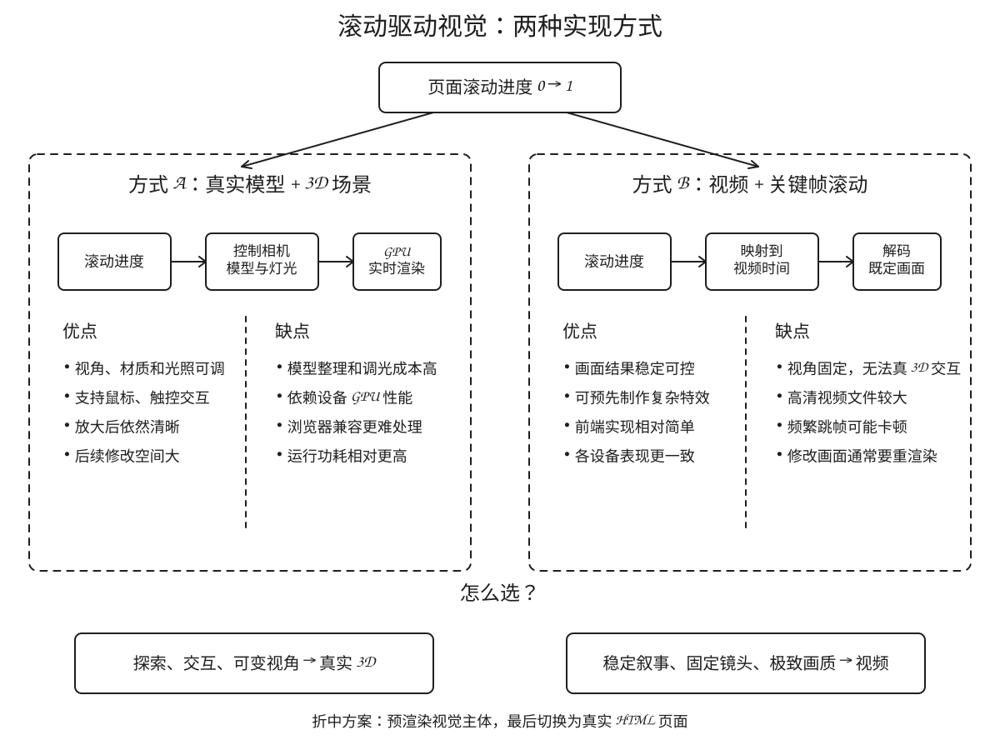

# Macintosh Scroll Into the Screen

一个以真实 Macintosh Classic 1991 `.glb` 模型为核心的创意前端实验：模型从屏幕中央的小尺寸开始，随着页面滚动连续旋转、放大，最后将视角推进到显示器屏幕，并交叉淡化接管为一套可由 HTML/CSS/SVG 构建的 1-bit MacPaint 风格页面。



静态截图：



## 两种实现路线

同类滚动视觉既可以用真实 3D 场景实时渲染，也可以把预渲染视频的播放时间绑定到滚动进度。下面的 Excalidraw 图概括了两种方案的流程、优缺点和适用场景。



- [视频关键帧方案生成提示词](video-prompt.md)
- [可编辑的 Excalidraw 源文件](docs/implementation-comparison.excalidraw)

## 在线体验

- GitHub Pages：[https://citarreikee.github.io/macintosh-scroll-site/](https://citarreikee.github.io/macintosh-scroll-site/)
- 本地预览：`python3 -m http.server 8000`

然后访问 `http://127.0.0.1:8000/`。

## 主要特性

- 使用真实的 `macintosh_classic_1991.glb`，包含烘焙材质和屏幕内的黑白画面。
- Three.js + GLTFLoader 实时渲染。
- GSAP ScrollTrigger 将滚动进度映射到连续旋转、位移和缩放。
- Canvas 和舞台严格固定为视口尺寸，页面滚动只负责产生动画进度。
- 最终阶段针对屏幕中心进行视觉标定，而不是简单对准整机包围盒中心。
- 交叉淡化到真实 HTML/CSS/SVG 的复古 MacPaint 界面。
- 响应式尺寸和高 DPI 渲染限制。

## 运行

项目是静态文件，不需要构建工具：

```bash
python3 -m http.server 8000
```

浏览器访问：

```text
http://127.0.0.1:8000/
```

也可以把 `index.html` 和 `macintosh_classic_1991.glb` 放到任意静态托管服务。

## 文件结构

```text
macintosh-scroll-site/
├── index.html                  # Three.js 场景、滚动时间轴和 MacPaint UI
├── macintosh_classic_1991.glb  # Macintosh Classic 1991 3D 模型
├── prompt.md                   # 从只有 GLB 文件开始复刻本项目的 Codex 提示词
├── video-prompt.md             # 使用生成视频复刻滚动效果的提示词与参数
└── docs/
    ├── implementation-comparison.excalidraw # 方案对比图的可编辑源文件
    ├── implementation-comparison.svg        # 方案对比图预览
    ├── scroll-preview.gif                   # 从模型到最终页面的滚动动画预览
    └── screenshot.png                       # 最终 MacPaint 页面截图
```

## 技术说明

模型文件来自用户提供的 `macintosh_classic_1991.glb`。GLB 内部是一个烘焙网格，没有独立命名的屏幕节点，因此最终“穿入屏幕”的阶段通过模型父级的屏幕中心偏移进行视觉标定。真实的最终页面不是贴图，而是单独的 HTML/CSS/SVG 层，从屏幕矩形裁剪范围扩展到全屏。

## 许可说明

本仓库中的模型元数据标注来源为 Daniel O’Neil 的 Sketchfab 模型 **Macintosh Classic (1991)**，许可证为 [CC BY 4.0](https://creativecommons.org/licenses/by/4.0/)。使用模型时请保留作者署名并遵守原始许可证。网页代码和提示词可按 MIT 方式复用。
